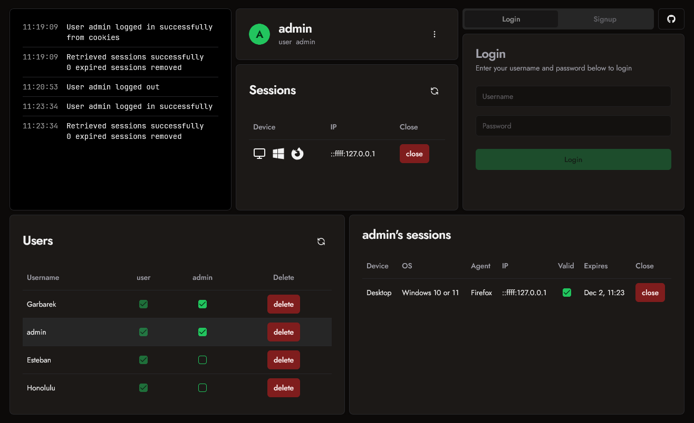
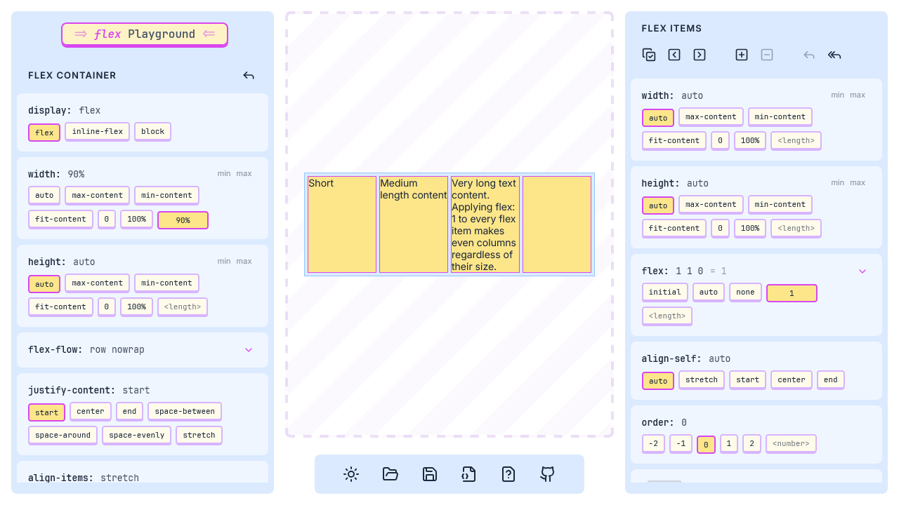
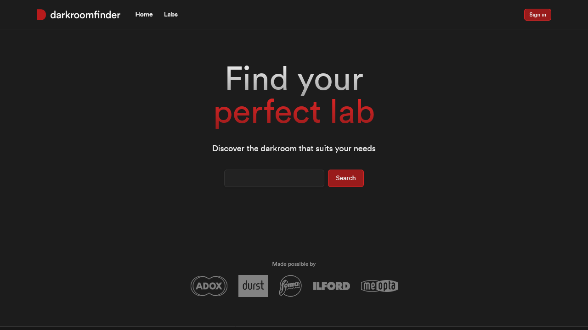
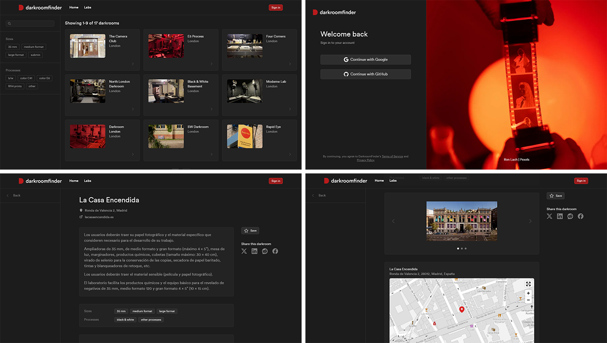
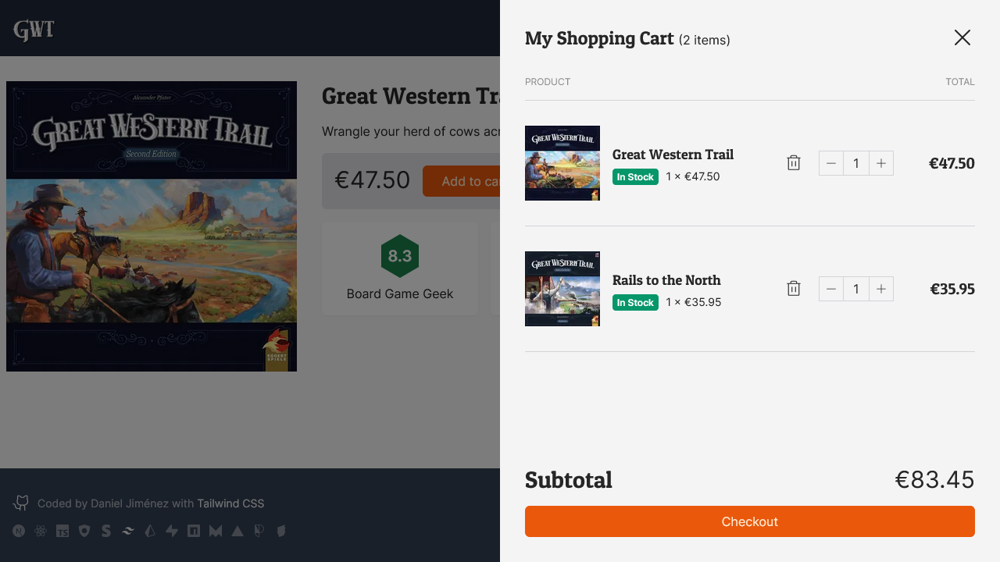
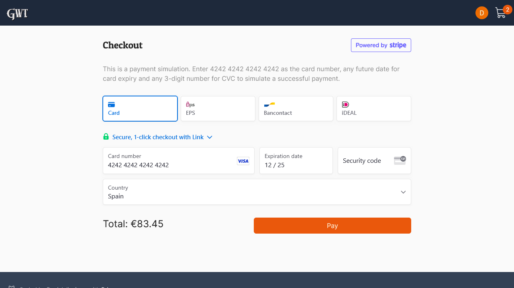
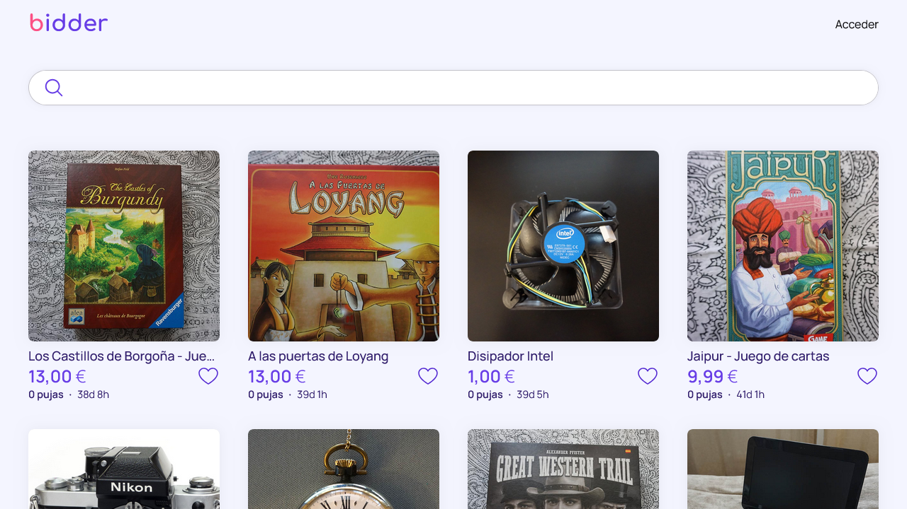
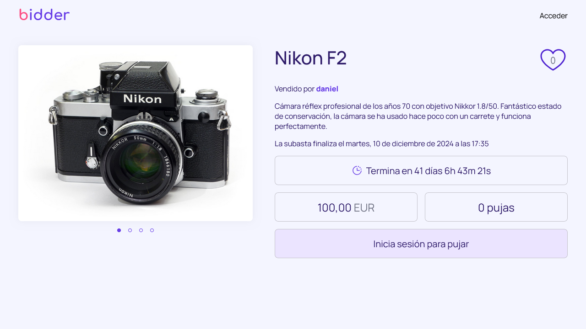

# Hi! I'm Daniel

I'm an aspiring web developer based in Madrid, Spain. I'm currently looking for a job as a **React developer**. Find me at [LinkedIn](https://www.linkedin.com/in/djimenezweb)!

## Tech stack

### Other tools I've used

## MERN Auth

Basic full stack authentication system built with **Express**, **MongoDB**, **React** and **shadcn/ui**.

- 🔗 Live demo: https://mern-auth-o1gw.onrender.com/
- 📄 Code: https://github.com/djimenezweb/mern-auth

## Flex Playground

An interactive CSS Flexbox playground made with **React**, **Framer Motion** and **Vite**.

- 🔗 Live demo: https://flex-playground.onrender.com/
- 📄 Code: https://github.com/djimenezweb/flex-playground

## Darkroom Finder

Photography lab finder built with **Next.js**, **TypeScript**, **Tailwind**, **MongoDB**, and **Cloudinary**. With authentication, maps, paginated search and other features.

- 🔗 Live demo: https://darkroomfinder.vercel.app/
- 📄 Code: https://github.com/djimenezweb/darkroomfinder

## GWT Store

Online store made with **Next.js**, **TypeScript**, **Stripe**, and **Supabase**.

- 🔗 Live demo: https://next-stripe-ecommerce-test.vercel.app/
- 📄 Code: https://github.com/djimenezweb/next-stripe-ecommerce

## Bidder

An online auction single page application built with **React**, **React Router**, and **Firebase**.

- 🔗 Live demo: https://bidder.onrender.com/
- 📄 Code: https://github.com/djimenezweb/bidder

## Contact me

- [LinkedIn](https://www.linkedin.com/in/djimenezweb)
